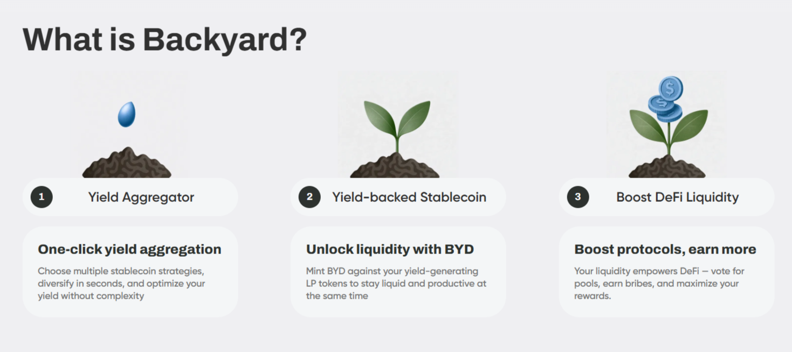

# 🪙 Backyard

An adaptive React + TypeScript web app with optimized images and modern styling.  
It displays content blocks with titles, descriptions, and high-resolution pictures.

🔗 [Live Demo](https://backyard-qubiq.vercel.app/)  

---


---

## ✨ Features
- ⚛️ **React + TypeScript** for a strong and scalable architecture  
- 🎨 **Tailwind CSS** for fast, responsive styling  
- 🖼 **Picture element with WebP/PNG** for retina-ready images  
- 📱 **Adaptive design** for mobile, tablet, and desktop

---



---

## 🛠️ Tech Stack
- React  
- TypeScript  
- Tailwind CSS  
- Vite (build & dev server)  
- ESLint for code quality
- Vercel for deploy

---

## 🚀 Run Locally

1. Clone the repository:
   ```bash
   git clone https://github.com/sofi-dobriak/backyard-qubiq.git
2. Navigate to the project folder:
    ```bash
    cd backyard-qubiq
3. Install dependencies:
    ```bash
    npm install
4. Start the development server:
    ```bash
    npm run dev
5. Open in your browser:
    ```bash
    http://localhost:5173
---

👩‍💻 Author: Sofi Dobriak